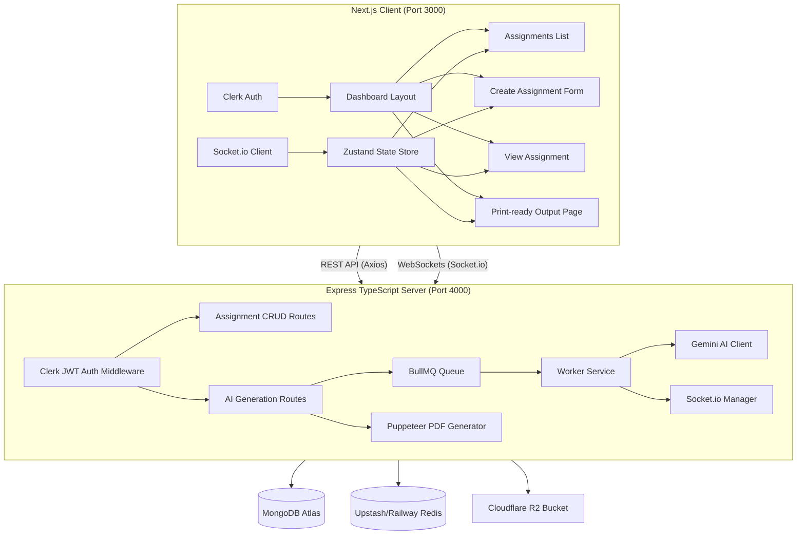

# 📚 VedaAI — AI Assessment Creator

VedaAI is a modern, full-stack, AI-powered assessment creation platform built for teachers and institutions. It allows educators to create assignments, upload reference PDFs, specify exact question patterns (such as MCQs, short answers, or long answers with customized marks), and generate premium-styled, print-ready exam question papers in real-time using Google Gemini AI.

---

## ⚡ Key Features

* **🔐 Authentication (Clerk)**: Complete, secure user registration and login flows with styled social login (SSO) integration.
* **📄 Document Parser**: Upload PDF, PNG, JPG, or DOCX reference files. The backend extracts context and streams it to the AI.
* **🎯 Structured Exam Design**: Build custom question blueprints by choosing question types, difficulty levels, count, and marks per question.
* **🤖 Gemini AI Structured Generation**: Utilizes Google Gemini's advanced structured schema output to construct highly accurate, context-aware exam papers.
* **📡 Real-time Updates (Socket.io)**: Watch the AI work in real-time with continuous progress status updates, automatically navigating to the output page when complete.
* **☁️ Cloud File Storage (Cloudflare R2)**: Statelss file uploading and high-speed PDF distribution powered by Cloudflare R2 (S3 API).
* **🖨️ Premium PDF Generation (Puppeteer)**: Automatically renders beautiful, institution-styled, double-underlined question sheets (with student name, roll number, and instructions) to print-ready PDF files.

---

## 🏗️ System Architecture



---

## 🛠️ Technology Stack

| Layer | Technology |
| :--- | :--- |
| **Frontend Framework** | Next.js 15 (TypeScript, App Router) |
| **Client Styling** | Vanilla CSS (Harmonious HSL palette, CSS variables) |
| **State Management** | Zustand (Global store with context binding) |
| **Authentication** | Clerk (JWT authorization) |
| **Backend Engine** | Node.js + Express (TypeScript, Node-slim container) |
| **Databases** | MongoDB (Mongoose ODM) |
| **Queuing & Caching** | BullMQ + ioredis (Gracefully optional fallback) |
| **AI LLM Client** | Google Generative AI (Gemini 2.0 Flash) |
| **Real-time Gateway** | Socket.io |
| **PDF Renderer** | Puppeteer (Headless Chromium) |

---

## ⚙️ Environment Variables Setup

### 🖥️ Client Environment (`client/.env.local`)
```ini
NEXT_PUBLIC_CLERK_PUBLISHABLE_KEY=pk_test_...
CLERK_SECRET_KEY=sk_test_...
NEXT_PUBLIC_API_URL=http://localhost:4000
NEXT_PUBLIC_SOCKET_URL=http://localhost:4000
NEXT_PUBLIC_CLERK_SIGN_IN_URL=/sign-in
NEXT_PUBLIC_CLERK_SIGN_UP_URL=/sign-up
NEXT_PUBLIC_CLERK_SIGN_IN_FALLBACK_REDIRECT_URL=/dashboard/assignments
NEXT_PUBLIC_CLERK_SIGN_UP_FALLBACK_REDIRECT_URL=/dashboard/assignments
```

### ⚙️ Server Environment (`server/.env`)
```ini
PORT=4000
MONGO_URI=mongodb://localhost:27017/vedaai
REDIS_URL=redis://localhost:6379
GEMINI_API_KEY=AIzaSyD...
CLERK_SECRET_KEY=sk_test_...
CLIENT_URL=http://localhost:3000
OPENROUTER_API_KEY=sk-or-v1-...

# Cloudflare R2 Config
R2_ACCOUNT_ID=812aa...
R2_ACCESS_KEY_ID=0069...
R2_SECRET_ACCESS_KEY=79cd...
R2_BUCKET_NAME=vedaai
R2_PUBLIC_URL=https://<your-bucket-public-url>
```

---

## 🚀 Local Development Setup

### Prerequisites
* **Node.js** v20+
* **MongoDB** running on `localhost:27017`
* **Redis** running on `localhost:6379` (Optional, server falls back to synchronous job generation if offline)

### 1. Launch the Backend Server
```bash
cd server
npm install
npm run dev
```

### 2. Launch the Next.js Frontend
```bash
cd client
npm install
npm run dev
```

Open [http://localhost:3000](http://localhost:3000) to view the application locally.

---

## 📦 Production Deployment

### 1. Frontend (Vercel)
* Connect your GitHub repository to **Vercel**.
* Set the Root Directory to `client`.
* Add the Client Environment Variables (refer to the guide above).
* Ensure `NEXT_PUBLIC_API_URL` and `NEXT_PUBLIC_SOCKET_URL` are prefixed with `https://`.

### 2. Backend (Railway or Render)
* Connect your repository to your PaaS of choice.
* Set the Root Directory to `server`.
* The server includes a production `Dockerfile` that automatically packages **Node.js, TypeScript compilation, and headless Chromium** for PDF generation.
* Set the Server Environment Variables (refer to the server `.env` variables above).
